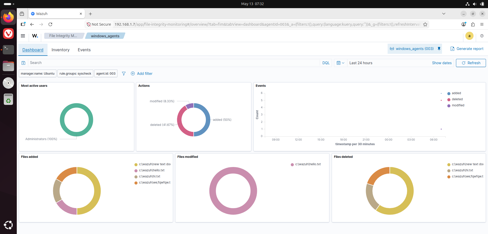
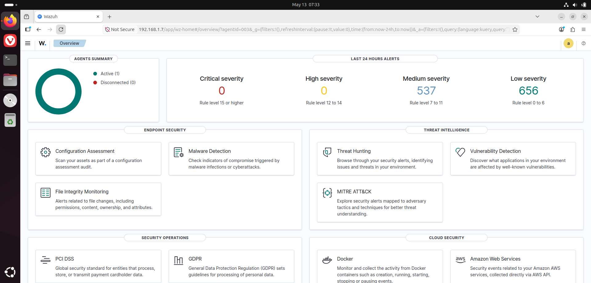
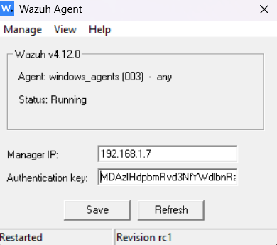
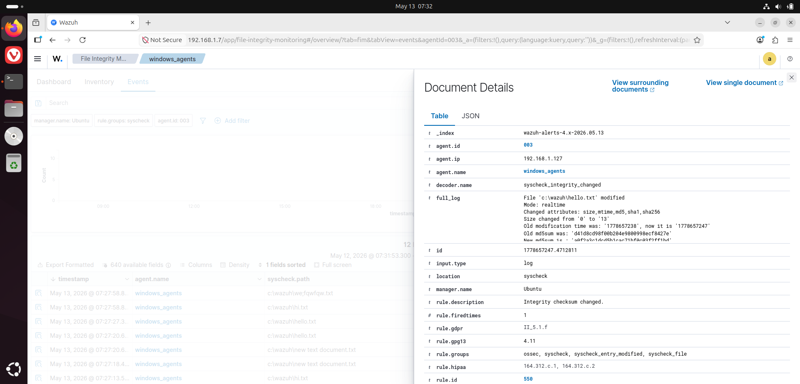

## Home SIEM Lab — Wazuh + File Integrity Monitoring
A homelab project where I deployed Wazuh, an open-source SIEM platform, to monitor a Windows host from an Ubuntu VM — and verified it works by capturing real file event alerts.

## How It Works
A Wazuh Manager runs on an Ubuntu VM and acts as the central brain — collecting, indexing, and displaying security alerts. A Wazuh Agent installed on the Windows host watches a designated folder in real time. Any file event (create, modify, delete) is forwarded to the manager and shows up as an alert on the Wazuh dashboard. This mirrors how enterprise SOC environments monitor endpoints for unauthorized or suspicious file changes.

## Demo
Tested by creating and modifying files inside the monitored folder on Windows — alerts appeared on the Wazuh dashboard in real time.

## Why This Matters
File Integrity Monitoring is a core capability in real SOC environments — it's how teams detect things like malware dropping files, unauthorized config changes, or insider threats. Setting this up hands-on gave me a ground-level understanding of how agents communicate with a SIEM, how log pipelines work, and how alerts are triggered and surfaced.

## What's Next
- Simulate attack scenarios (brute-force, failed logins) and capture the alerts
- Write custom Wazuh detection rules
- Expand monitoring beyond FIM — process events, network activity
- Integrate Suricata for network-level visibility
